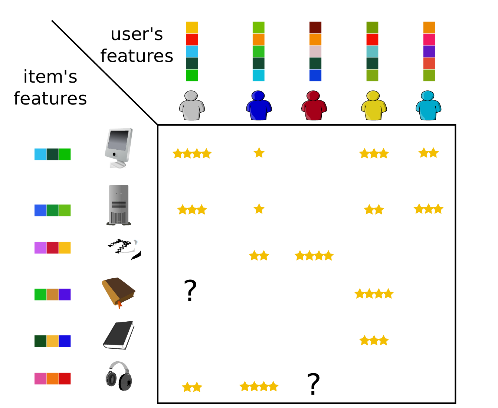
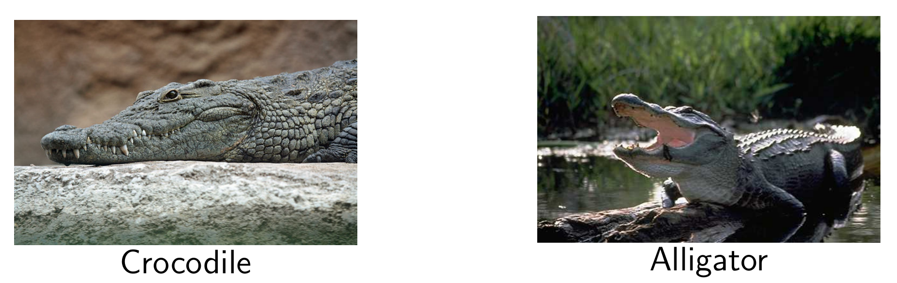

# Data Science Lab

This repository serves as a portfolio hub for the three group assignments completed during the Data Science Lab at ENS-PSL (M2 IASD).

The course focuses on applying theoretical knowledge to practical, research-oriented challenges. Each assignment required reading scientific publications, implementing one or more advanced models, and comparing them against baselines.

## 1. Recommendation with Collaborative Filtering

* **Repository:** [github.com/jules-roques/Collaborative-Filtering](https://github.com/jules-roques/Collaborative-Filtering)
* **Objective:** To implement, analyze, and evaluate different collaborative filtering algorithms for a recommendation task.
* **Achievements:** We implemented and compared dimension reduction approaches: **Matrix Factorization** with **Alternating Least Squares (ALS)** and **Gradient Descent** as baselines, and **iterative PCA** & **iterative Kernel PCA** as advanced solutions.
* **Keywords:** Recommendation Systems, Collaborative Filtering, Matrix Factorization, ALS, Gradient Descent, PCA.

## 2. Quality vs. Diversity in Generative Models

* **Repository:** `[COMING SOON]`
* **Objective:** To explore latent space representations and their application to synthetic image generation, balancing sample quality and diversity.
* **Achievements:** `[COMING SOON]`
* **Keywords:** Generative Models, GANs, VAEs, Latent Space, Image Generation, MNIST, FID.

## 3. Adversarial Attacks in Classification Models

* **Repository:** `[COMING SOON]`
* **Objective:** `[COMING SOON]`
* **Description:** `[COMING SOON]`
* **Keywords:** `[COMING SOON]`